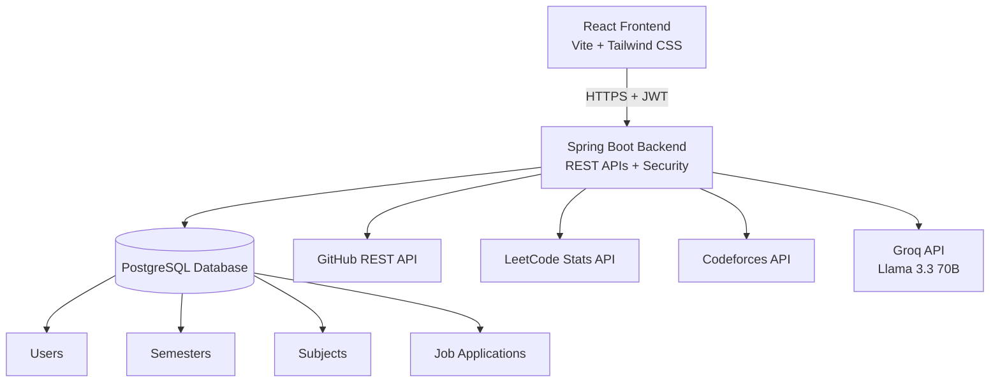
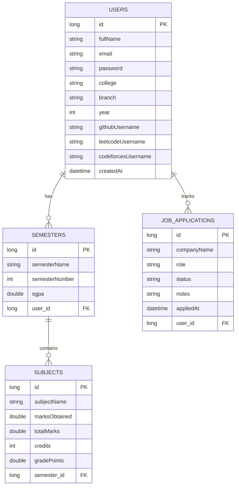

<div align="center">

# StudentOS

### A full-stack dashboard for student developers

Track academics, monitor coding profiles, manage job applications, practice problems, and get AI-powered assignment help from one place.

[](#)
[](#)
[](#)
[](#)
[](#)

</div>

---

## Overview

StudentOS is a complete productivity dashboard built for computer science students who constantly switch between academic portals, coding platforms, spreadsheets, and AI tools.

Instead of tracking GPA in one place, job applications in another, Codeforces ratings in a browser tab, and assignment questions in a separate chatbot, StudentOS brings everything into one clean interface.

The project is built from scratch with a Spring Boot backend, PostgreSQL database, JWT authentication, and a React frontend.

---

## Features

### GPA Tracker

- Add semester-wise SGPA records.
- Track academic performance over time.
- View donut charts for individual semesters.
- View bar charts for semester-by-semester trends.
- Calculate CGPA using the weighted formula:

```text
CGPA = sum(SGPA x Credits) / sum(Credits)
```

### Job Application Tracker

- Add job applications with company name, role, status, and notes.
- Track each application through stages such as Applied, Interview, Offer, and Rejected.
- View quick stats for applications at each stage.
- Delete applications that are no longer needed.

### Coding Profiles

- Connect a GitHub username to view repositories, followers, and profile details.
- Connect a LeetCode username to view problem-solving stats and ranking.
- Connect a Codeforces handle to view rating, max rating, rank, and avatar.

### Problem Practice

- Browse 200+ Codeforces problems inside the app.
- Filter problems by rating, from beginner-friendly 800-level problems to advanced 2000+ problems.
- Filter by topic tags.
- Search problems by name.
- Open any problem directly on Codeforces.

### AI Assignment Solver

- Use a floating chatbot from the dashboard.
- Ask academic questions related to math, DSA, theory, or code.
- Get AI-powered responses through Llama 3.3 70B using the Groq API.

### Secure Authentication

- JWT-based authentication.
- BCrypt password hashing.
- Protected API routes.
- User-specific data access, so each user only sees their own dashboard data.

---

## Tech Stack

### Backend

| Technology | Purpose |
| --- | --- |
| Java 17 | Core backend language |
| Spring Boot 3.5 | Backend framework |
| Spring Security | Authentication and authorization |
| JWT | Stateless authentication |
| Spring Data JPA | ORM and repository layer |
| Hibernate | SQL generation and entity management |
| PostgreSQL 17 | Primary database |
| Maven | Dependency management and builds |

### Frontend

| Technology | Purpose |
| --- | --- |
| React 19 | UI framework |
| Vite | Frontend build tool |
| Tailwind CSS | Styling |
| Axios | API requests |

### External APIs

| API | Used For |
| --- | --- |
| GitHub REST API | GitHub profile, repository, and follower data |
| LeetCode Stats API | LeetCode ranking and problem-solving stats |
| Codeforces API | Rating, rank, handle, and contest data |
| Groq API | AI assignment solver powered by Llama 3.3 70B |

---

## Architecture



### Deployment

| Layer | Platform |
| --- | --- |
| Frontend | Vercel |
| Backend | Railway |
| Database | Railway PostgreSQL |

---

## Getting Started

### Prerequisites

Make sure you have the following installed:

- Java 17 or later
- Node.js 20 or later
- PostgreSQL 17
- Maven
- Git

### Clone the Repository

```bash
git clone https://github.com/<your-username>/student-developer-dashboard.git
cd student-developer-dashboard
```

### Backend Setup

```bash
cd studentdashboard
cp src/main/resources/application.properties.example src/main/resources/application.properties
```

Update `src/main/resources/application.properties` with your local configuration:

```properties
spring.datasource.url=jdbc:postgresql://localhost:5432/studentdashboard
spring.datasource.username=postgres
spring.datasource.password=YOUR_POSTGRES_PASSWORD

groq.api.key=YOUR_GROQ_API_KEY
```

Create the database:

```bash
psql -U postgres -c "CREATE DATABASE studentdashboard;"
```

Run the backend:

```bash
mvn spring-boot:run
```

The backend runs at:

```text
http://localhost:8080
```

### Frontend Setup

Open a new terminal from the project root:

```bash
cd student-dashboard-frontend
npm install
npm run dev
```

The frontend runs at:

```text
http://localhost:5173
```

---

## API Reference

### Authentication

| Method | Endpoint | Description |
| --- | --- | --- |
| POST | `/api/auth/register` | Register a new user |
| POST | `/api/auth/login` | Log in and receive a JWT token |

Example register body:

```json
{
  "fullName": "Dhruv Gupta",
  "email": "dhruv@example.com",
  "password": "password123",
  "college": "Your College",
  "branch": "CSE",
  "year": 1
}
```

Example login body:

```json
{
  "email": "dhruv@example.com",
  "password": "password123"
}
```

### GPA

| Method | Endpoint | Description |
| --- | --- | --- |
| POST | `/api/gpa/semester` | Add a semester |
| POST | `/api/gpa/subject` | Add a subject with marks |
| GET | `/api/gpa/semesters/{userId}` | Get all semesters for a user |
| GET | `/api/gpa/cgpa/{userId}` | Get calculated CGPA |

### Job Applications

| Method | Endpoint | Description |
| --- | --- | --- |
| POST | `/api/jobs/add` | Add a job application |
| PUT | `/api/jobs/status/{jobId}` | Update application status |
| GET | `/api/jobs/list/{userId}` | Get all applications for a user |
| DELETE | `/api/jobs/delete/{jobId}` | Delete an application |

### Coding Profiles

| Method | Endpoint | Description |
| --- | --- | --- |
| GET | `/api/github/stats/{username}` | Get GitHub profile stats |
| GET | `/api/leetcode/stats/{username}` | Get LeetCode stats |
| GET | `/api/codeforces/stats/{handle}` | Get Codeforces profile stats |

### AI Chatbot

| Method | Endpoint | Description |
| --- | --- | --- |
| POST | `/api/chatbot/ask` | Ask the AI chatbot a question |

Example request body:

```json
{
  "question": "Explain binary search with an example."
}
```

---

## Database Model



---

## What I Learned

Building StudentOS helped me practice:

- Designing REST APIs with Spring Boot.
- Implementing JWT authentication with Spring Security.
- Hashing passwords securely with BCrypt.
- Modeling relational data with JPA and Hibernate.
- Working with one-to-many and many-to-one database relationships.
- Integrating third-party APIs into a backend service.
- Building reusable React components with hooks.
- Managing API requests with Axios.
- Handling protected routes and authenticated frontend state.
- Configuring CORS for a full-stack deployment.
- Deploying a full-stack app with Railway and Vercel.

---

## Author

**Dhruv Gupta**  
First-year B.Tech CSE student

---

<div align="center">

Built with Java, Spring Boot, React, and PostgreSQL.

</div>